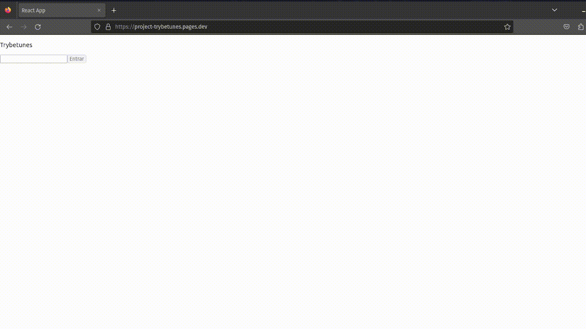

# Project Trybetunes

Neste projeto criei um site de busca de musica, na usuário faz o seu login, busca o álbum que deseja, seleciona o álbum e pode ouvir trechos de musica deste álbum, além de favorita as músicas que mais gostou. Neste projeto aprendi a utilizar utilizando ciclos de vida de um componente do React, além da utilização setState, BrowserRouter, React Router, além é claro da utilização da API em react. Para ver o site que eu criei utilizando este conhecimento clique em _[Project Trybetunes](https://project-trybetunes.pages.dev/)_

